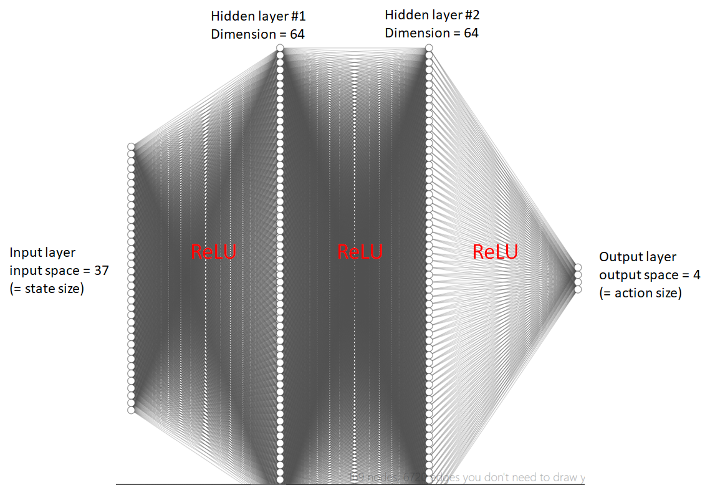
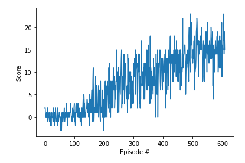
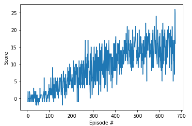

[//]: # (Image References)

[image1]: https://user-images.githubusercontent.com/10624937/42135619-d90f2f28-7d12-11e8-8823-82b970a54d7e.gif "Trained Agent"

# Project 1: Navigation

## Introduction

For this project, you will train an agent to navigate (and collect bananas!) in a large, square world.  

![Trained Agent][image1]

A reward of +1 is provided for collecting a yellow banana, and a reward of -1 is provided for collecting a blue banana.  Thus, the goal of your agent is to collect as many yellow bananas as possible while avoiding blue bananas.  

The state space has 37 dimensions and contains the agent's velocity, along with ray-based perception of objects around agent's forward direction.  Given this information, the agent has to learn how to best select actions.  Four discrete actions are available, corresponding to:
- **`0`** - move forward.
- **`1`** - move backward.
- **`2`** - turn left.
- **`3`** - turn right.

The task is episodic, and in order to solve the environment, your agent must get an average score of +13 over 100 consecutive episodes.

## Getting Started

1. Download the environment from one of the links below.  You need only select the environment that matches your operating system:
    - Linux: [click here](https://s3-us-west-1.amazonaws.com/udacity-drlnd/P1/Banana/Banana_Linux.zip)
    - Mac OSX: [click here](https://s3-us-west-1.amazonaws.com/udacity-drlnd/P1/Banana/Banana.app.zip)
    - Windows (32-bit): [click here](https://s3-us-west-1.amazonaws.com/udacity-drlnd/P1/Banana/Banana_Windows_x86.zip)
    - Windows (64-bit): [click here](https://s3-us-west-1.amazonaws.com/udacity-drlnd/P1/Banana/Banana_Windows_x86_64.zip)
    
    (_For Windows users_) Check out [this link](https://support.microsoft.com/en-us/help/827218/how-to-determine-whether-a-computer-is-running-a-32-bit-version-or-64) if you need help with determining if your computer is running a 32-bit version or 64-bit version of the Windows operating system.

    (_For AWS_) If you'd like to train the agent on AWS (and have not [enabled a virtual screen](https://github.com/Unity-Technologies/ml-agents/blob/master/docs/Training-on-Amazon-Web-Service.md)), then please use [this link](https://s3-us-west-1.amazonaws.com/udacity-drlnd/P1/Banana/Banana_Linux_NoVis.zip) to obtain the environment.

2. Place the file in the DRLND GitHub repository, in the `p1_navigation/` folder, and unzip (or decompress) the file. 

## Instructions

I'm using Windows10/64 without any GPU, only CPU available on my laptop. 
Furthermore I was using Visual Studio Code and Anaconda. The development of the solution took place under Visual Studio Code and the Anaconda Shell. 


### Install Environment
1. Anaconda

Download and install: https://repo.anaconda.com/archive/Anaconda3-2020.02-Windows-x86_64.exe

2. Environment
Python 3.6 Environment and not newer is necessary because of Unity 0.4 dependencies like Tensorflow
```
    conda create -n unity_mlagent python=3.6
    conda activate unity_mlagent
```
3. Tensorflow 

    Download of wheel because pip install was not working directly
https://files.pythonhosted.org/packages/fd/70/1a74e80292e1189274586ac1d20445a55cb32f39f2ab8f8d3799310fcae3/tensorflow-1.7.1-cp36-cp36m-win_amd64.whl
```
    pip install tensorflow-1.7.1-cp36-cp36m-win_amd64.whl
```
4. Unity ML Agents

    Download Unity ml agents https://codeload.github.com/Unity-Technologies/ml-agents/zip/0.4.0b and unzip
```
    cd ml-agents-0.4.0b\python
    pip install .
```

5. Pytorch

    Pytorch will be used for the DQN Agent
```
    conda install -c pytorch pytorch
```

6. Additional packages
```
    pip install pandas git
```

7. Banana Environment

    Download https://s3-us-west-1.amazonaws.com/udacity-drlnd/P1/Banana/Banana_Windows_x86_64.zip 
    Unzip in project folder so that ```Banana_Windows_x86_64/Banana.exe```can be found

8. Install version control system Git

Download and install:
https://github.com/git-for-windows/git/releases/download/v2.26.2.windows.1/Git-2.26.2-64-bit.exe


### Perform Train and testing of DQN Agent via jupyter Notebook
1. Start python environment
    
    Call Anaconda prompt via Windows Start menu

 

```
    cd <project folder>
    conda activate unity_mlagent
``` 

2. Clone project
```
    git clone https://github.com/AntoniaSophia/DRLND_BananaCollector.git
    cd DRLND_BananaCollector
```
3. Start of jupyter environment
```
    jupyter notebook
```

4. Open DQN_Solution.ipynb and follow the steps

## Description of my solution

In this chapter I describe my solution to this project. My solutions consists of the following files:
   - `Solution.ipynb` - this is the Jupyter notebook containing my solution
   - `dqn_agent.py` - this is a vanilla DQN agent and contains the following parameters
     - `env` - the environment where the Banana Collector is contained in
     - `brain_name` - the brain_name of the Banana Collector
     - `maxEpisodes` - maximum limit of episodes to be executed
     - `threshold` - the threshhold of average reward in order to successfully finish training
     - `eps_start` - starting value of epsilon
     - `eps_end` - lower limit of epsilon
     - `eps_decy` - the decay rate of epsilon after each episode
     - `seed` - seed of the randomizer (keep constant in case you want to get reproducable results!)
     - `filename` - the filename to store the trained agent's network 
     - `memory_type` - the type of memory being used for replay 
  
   - `model.py` - the neural network of the DQN
   - `DequeMemory.py`  - an implementation of the replay memory based on deque data structure
   - `FifoMemory.py`  - an alternative implementation of the replay memory based on a simple first-in-first-out (FIFO) eviction scheme
   - `Solution.py` - this basically has the same content as the Jupyter notebook - it was my 


## The neural network
The DQN performs the mapping between input states and predicted optimal actions. The state space is 1 dimensional and has 37 states, thus using fully connected layers is suffienct and no convolutional layers are required.

Hence the input layer receives 37 states and the output layer has size 4:
- **`0`** - move forward
- **`1`** - move backward
- **`2`** - turn left
- **`3`** - turn right

I simply used the model which was also used in the lesson 2 (DQN) - basically it is identical.

 

I played around with the dimensions of the hidden layers, but it seems that using `size(fc1)=Size(fc2) = 64` (both hidden layer dimensions = 64) is the optimal setting.

All other variants - either using less or increasing - finish the task only with more episodes.

## Used parameters

In the next section I'm going to explain all the parameters I have chosen.

### DQN Agent

  - `eps_start=1.0` - starting with maximum exploration (when using epsilon-greedy policy) is always a good advise....
  - `eps_end=0.02` - this lower limit of epsilon I found during try&error approach
  - `eps_decay=0.995` - I took this parameter from the paper XYZ
  - `seed = 999` - the seed for the randomizer (I kept it constant in order to be able to compare results)

  - `BUFFER_SIZE = int(1e5)` - having 100000 samples to store 
  - `BATCH_SIZE = 32` - The batch size for every replay memory learning after each step
  - `GAMMA = 0.99` # discount rate
  - `TAU = 1e-3` # soft updating of target params
  - `LR = 5e-4` # learning rate of the gradient descent of the neural network
  - `UPDATE_EVERY = 4` # how often to update the network (remember the stick-carrot problem !!)


### Other parameters
  - `maxEpisodes = 3000` - Set the maximum number of episodes which the agent 
  - `threshold = 15.0` - the value to be reached by the agent in order to be successful. Actually 13.0 was required, but I tried to push the limit....
  - `filename = "checkpoint.pth"` - the filename for storage of the trained model
  - `train = True` - this parameter should be set to True in case you would like to train, otherwise set this parameter to False
  - `memory_type = 0` - this parameters is either 0 (using Fifo memory) or 1 (using Deque memory)


## Discussion

Finally I was able to solve this task for the threshold = 15.0
  - within 609 episodes for FifoMemory 
  
 


  - within 674 episodes for DequeMemory

 


Basically the deque datastructure and FIFO is almost similar, just the order of the elements is different. My result could indicate that using a Fifo is more efficient, but in fact just running a few tests in one project is definitely not enough to conclude on that. I admit, I was just playing around with some ideas I found in the Internet....

Setting `BATCH_SIZE = 32` worked best as I found out during several attempts simply by try & error. 

During the consecutive test of 100 episodes it sometimes happens that the score in this episode is much less than 10. Reason seems to be that the agent is "toggling" between left and right action. At least this is what I have observed watching the agent.
Definitely this could be improved but first of all it must be found out whether it is any problem with the Unity Banana Collector engine, or the DQN itself. I suspect the problem is with the DQN, but I have not investigated further. Assumin it is a problem with the DQN I would try to record also some longer action traces and remove those samples from the memory which show an action behavior like `2` `3` `2` `3` `2` `3` `2` `3` `2` `3` `2` `3` 

What I also tried out was to work with a second replay memory which contains the "golden samples" - a kind of sample sequence which led to high cumulative rewards. At sampling time I tried to mix between the samples from the "regular" memory and this "golden sample memory", e.g. 75% is taken from regular memory and 25% from this golden sample memory. The result was that the learning process was much slower than without - that's why I didn't follow up on that idea any longer - possible it was somehow naive to think it was so easy to contribute own ideas which are totally new..... 


Further potential improvements:
- Using a Dueling DQN
- Using a prioritized memory buffer
- other "cool stuff" from the Rainbow DQN

## Final remark - famous last works... ;-)
As I'm completely new to deep reinforcement learning, I was really really glad when the first project came and I could start some coding. There was so much of theory and new terms and somehow I felt like having to learn 20 years of research within a few weeks. I was very happy that I could all bits and pieces together and solve the task now in much less than 1800 episodes. And unless I really understood a lot I still feel that many many details are not yet digested yet. 

What I'm planning to realize further is an implementation of the prioritized replay memory and of course I hope we get the chance also to work with the DQN Rainbow during the course of the Nanodegree. 

All in all it was a lot of fun, I really learned a lot of new things and enjoyed!

